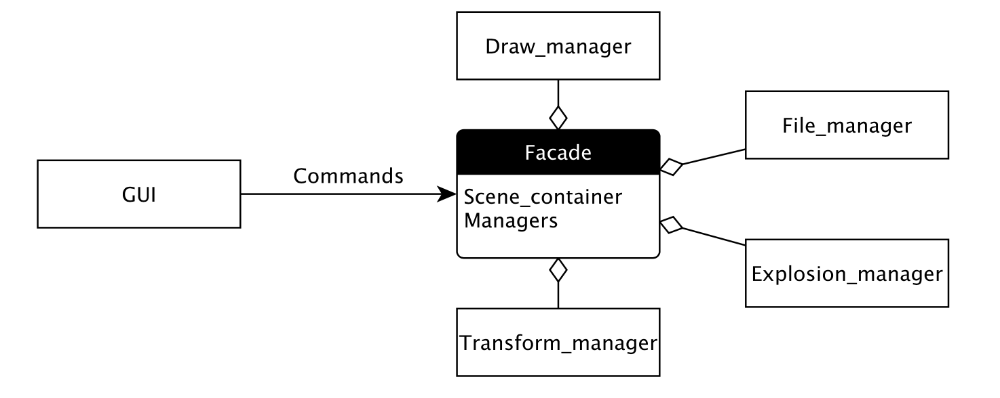
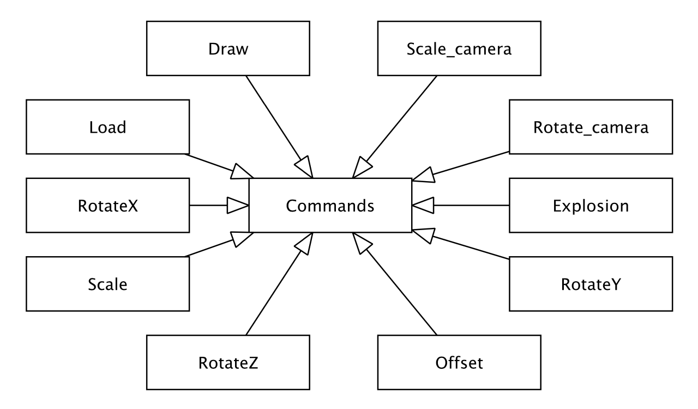
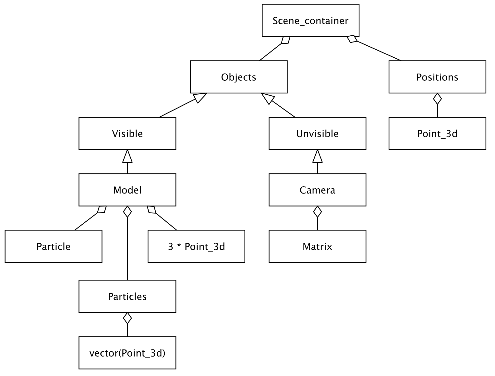

# Particle_explosion

## Приложение для визуализации взаимодействия большого числа частиц при столкновении, взрыв. 

Версия v1.0.0

Course project at 5th semestr of BMSTU (2019)

Example of course work

Целью работы является создание максимально приближенной модели взрыва большого числа частиц. Объекты в сцене представлены в виде твердых частиц, которые приводятся в движение различными силами. 

Для выполнения проекта был выбран язык программирования C++/QT.

В данной работе, используется объектно-ориентированный подход программирования и паттерны проектирования.

